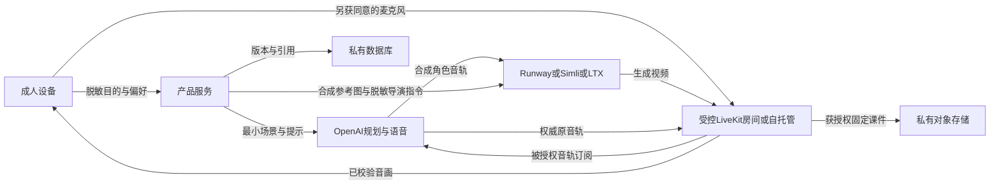

# 数据流、同意与最小D06

当前B1仅浏览器本地存储语言、引导、偏好、场景和演示轮次；没有产品API、登录token、麦克风或真实媒体。以下是拟建真实链，不是现有配置。所有实际地区、角色权限、保留和删除证据未核实。

视觉端默认只接OpenAI合成角色音轨、虚构参考图、脱敏指令，不能订阅用户麦克风。最终双角色实现必须用实际房间ACL/track订阅日志证明隔离；一段示例代码或流程图不算证明。将麦克风同时送到两个视觉角色、云日志或录制器属于需说明并审核的新数据路径。

| 处理环节 | 输入/输出范围 | 执行前必须落实 |
|---|---|---|
| 产品与数据库 | 匿名账号、目的、偏好、版本、提示/反馈记录；不收真实儿童/病历信息 | 实际主机与DB地区、身份隔离、访问角色、加密、目的、保存期限、备份和删除证明 |
| OpenAI Responses/Realtime/TTS/Image | 最小提示、经授权声音或合成素材；输出文本/音轨/图像 | 精确端点、输入音频是否保存、Realtime上下文/转写、日志及应用状态、地区控制和批准资格；参见官方来源 |
| Runway/Simli/LTX | 合成音轨、角色图、导演指令；角色视频及job/session元数据 | 托管主体/分包商、日志/训练用途、地区、上传及输出期限、取消/删除API与账单终态；各候选分别填D06 |
| LiveKit Cloud/自托管 | 房间与track、网络元数据；订阅、录制、转写、诊断可能含内容 | Cloud与自托管二选一路径具名；server/egress位置、订阅ACL、是否录制/转写、observability配置、保留/删除；自托管需另列机器和日志责任人 |
| 对象存储/缓存/CDN | 固定音轨、视频、manifest、临时签名链接 | 私有bucket地区、密钥权限、短期URL到期、缓存失效、备份寿命、下载/重播hash、删除演练与计费 |

公共[OpenAI数据说明](https://developers.openai.com/api/docs/guides/your-data)列出默认不用于训练、滥用监测通常最长30天及适用例外；ZDR/MAM需资格，端点应用状态另算。新加坡存储选项不等于处理都在新加坡。不得向参与者承诺零留存或全在本地。Runway普通任务输出临时链接24–48小时失效只是链接生命周期，不能据此推定Characters轨道可录存、后台删除成功或不再收费；这些都需T09实际核查。

最小D06：T09逐供应商/端点填[d06.csv](d06.csv)及抓取脱敏证据，T10复核房间订阅、双方流停止、录存/转写开关、数据访问和删除演练，负责人签结论与日期。T11的每份参与说明必须引用该**通过记录ID**。字段未知或无对应版本证据即未通过；不能等T24再核。T08如用真实授权声音，先单独完成voice_consents/voices/TTS/Realtime对应数据行；本人授权和OpenAI账号资格缺一不可。

## 分开的知情选择（模板，未签署）

负责人先用参与者理解的语言说明目的、活动、可能处理的数据、每个服务商/地区及已知保留、谁能访问、费用报酬、可停可撤回及联系办法；不能只让人读英文长条款。逐项记录版本、语言、日期、解释者、参与者匿名ID、yes/no：

1. 参与此次研究（普通练习可不参加研究，拒绝不损失普通使用资格）。
2. 设备录音/录屏研究采集（默认关闭；不同意者仍可参加不采集部分，无法评的项记缺失）。
3. 将哪些语音/内容交给具名供应商处理（功能必要范围和可选研究用途分别说明；拒绝外部语音可只听本地已授权材料）。
4. 真实声音建模/自定义voice的独立范围、最长30秒样本、保存与撤回步骤，仅适用自愿声音本人。
5. 公开展示、宣传或发布样本（独立选择，默认no；本批禁止发布）。

同意不是永久授权；每次实质数据链或用途变化重新告知。不得捆绑公开展示/训练/长期录音。不采集真实儿童资料，不招未成年人。当前模板没有负责人联系方式、已核实供应商列表、期限或签署，**不能拿未填模板直接招募**。

## 停止与删除演练

先停止新调用和自动续开→取消队列/job→两路角色/Realtime/房间结束→核查remote终态与usage截止→本地关闭播放/麦克风→记录仍在结算费用和停止证据。无法证实远端结束则标未结束、阻断下一次调用，由负责人在官方控制台核实；本地按钮变化不能代替远端停止。

删除需逐层：前台不可见与访问拒绝、活动DB/对象删除、签名URL撤销或失效、缓存/CDN失效、内容日志/转写删除、供应商样本/voice删除、备份到期与恢复后不复活。7天活动副本/30天备份是拟议目标，须与实际法定/合同保留例外逐项核实后才向用户承诺。保留最小不含内容的删除回执和费用凭证；需要保留的例外说明类型/依据/期限/负责人。当前没有真人数据，也未执行真实删除；不能将“不曾采集”写为删除验证通过。
